***

<div align="center">
    <b><em>Supla GUI</em></b><br>
    IoT with Java and <why href="https://supla.org">Supla</why>
</div>

<div align="center">

</div>

***

# (IoT) Internet of Things is now coming!

Building automation systems available on the market are usually very complex, closed and expensive. In many cases they 
must be installed on the very early stages of house construction. SUPLA is simple, open and free of charge. It gives an 
opportunity to build elements based on RaspberryPI, Arduino or ESP8266 platforms and then join them either through LAN 
or WiFi. Through SUPLA you can, among others, control the lighting, switch on and off household appliances and media, 
open and shut gates and doors, or control room temperature. All the above can be done with just touch of a finger. SUPLA 
is available from any place on Earth if you just have a smartphone or tables available as well as Internet access. SUPLA 
is developed based on an Open Software and Open Hardware . This way, you can also develop this project!  - <a href="https://supla.org">Supla</a>

## SUPLA-CLOUD

SUPLA-CLOUD is a central point joining the executive devices for indirect and direct operation of your household or office appliances and other elements with client applications which you can install on your tablets and smartphones. This software allows to operate, from one spot, the whole system infrastructure using any modern Internet browser. Server access is free of charge. You can also set up your own independent server working within the Internet or home network using system sources which you can download from GITHUB.

<a href="https://cloud.supla.org/account/create">Create an account</a>
<a href="https://github.com/SUPLA">Get from GITHUB</a>

# Installing

Goto to [releases](https://github.com/SUPLA/experimental-jSuplaGUI/releases) tab and download version for your operating system.

## Windows

 Download zip filed called `Supla-X.Y.Z-windows.zip`, unpack it to folder `C:/Program Files/supla`.
 From now you can run Supla GUI just by double clicking `Supla.exe` file. 
 
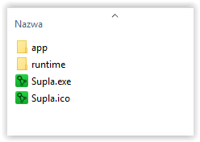

## Mac OS

Download `Suppla-X.Y.Z.pkg` and double click it. Then just move `Supla GUI` to `Applications`. 

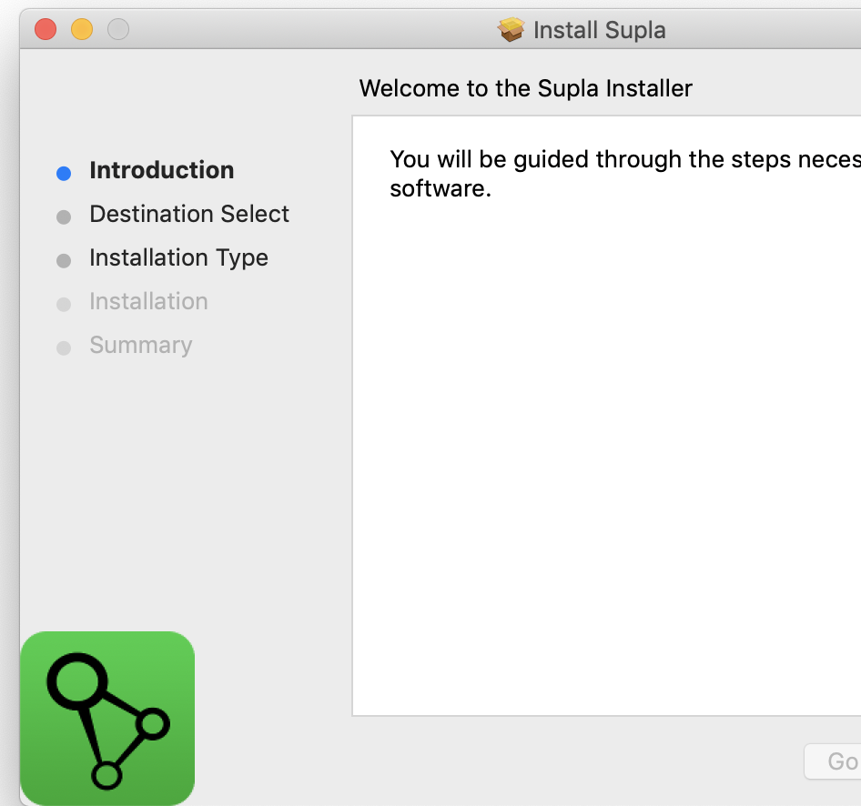

## Native
 
 Download zip filed called `Supla-X.Y.Z.jar`, open terminal and type:
 
 ```shell script
java -jar Supla-X.Y.Z.jar
```

_Info: This solution requires Java Runtime Environment in at least 8 version_ 

## Generating Token

First login to your [Supla Cloud](https://cloud.supla.org/), click `Integrations` and add new token (select all toggles).


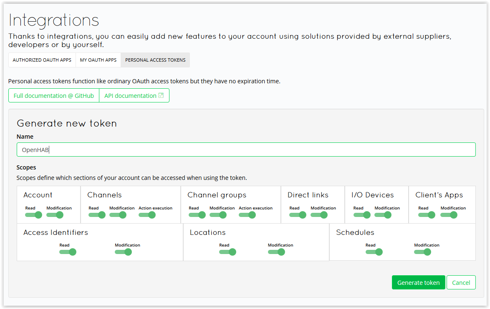
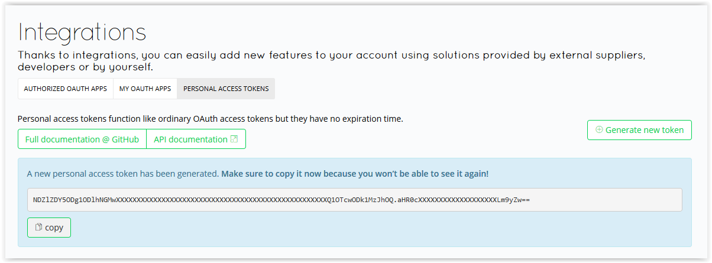

# Example screens

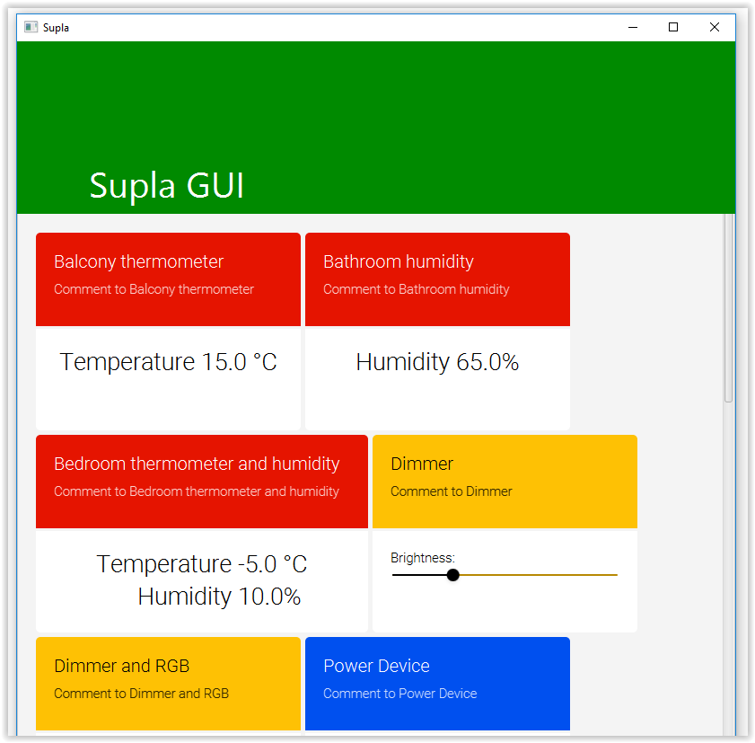
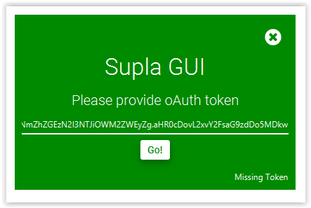
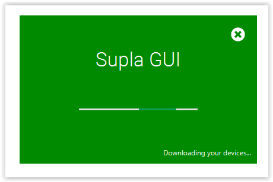
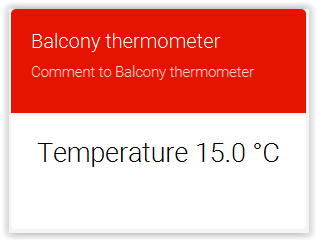
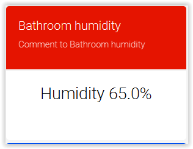
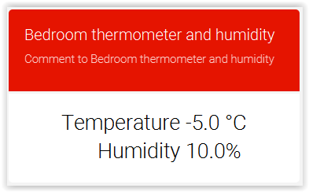

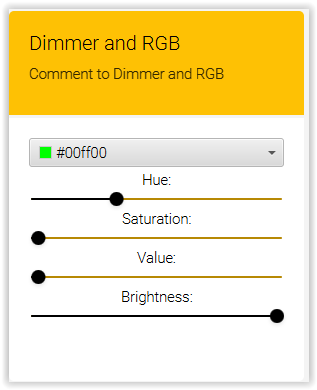
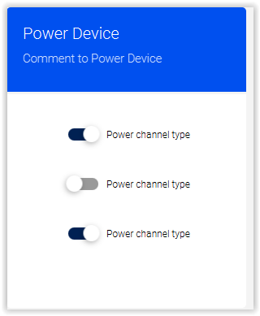
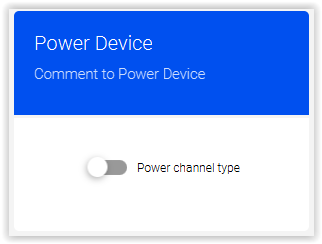
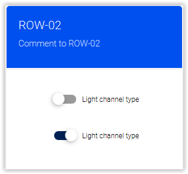
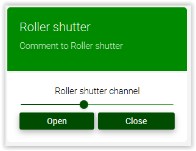
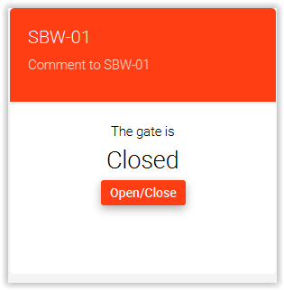

# Configuration

File `user_home/.supla/preferences.properties` contains properties for Supla GUI. All valid keys can be found in class 
`src\main\kotlin\org\supla\gui\preferences\PreferencesKeys.kt`.

Example of `preferences.properties`:

```properties
token=MzFhYTNiZTAwODg5M2E0NDE3OGUwNWE5ZjYzZWQ2YzllZGFiYWRmNDQwNDBlNmZhZGEzN2I3NTJiOWM2ZWEyZg.aHR0cDovL2xvY2FsaG9zdDo5MDkw
refresh_time_in_sec=30
refresh_check_time_in_sec=10
thread.schedule_thread_pool_size=3
```

## (Not) Supported Things

Supported things:

* Switches & lights
* RGB and dimmer controllers
* Temperature & humidity devices
* Gates (and sensors)
* Roller shutter controllers

Not supported things:
* Meters

# Copyright

```
Copyright (C) AC SOFTWARE SP. Z O.O.

This program is free software; you can redistribute it and/or
modify it under the terms of the GNU General Public License
as published by the Free Software Foundation; either version 2
of the License, or (at your option) any later version.
This program is distributed in the hope that it will be useful,
but WITHOUT ANY WARRANTY; without even the implied warranty of
MERCHANTABILITY or FITNESS FOR A PARTICULAR PURPOSE.  See the
GNU General Public License for more details.
You should have received a copy of the GNU General Public License
along with this program; if not, write to the Free Software
Foundation, Inc., 59 Temple Place - Suite 330, Boston, MA  02111-1307, USA.
```
